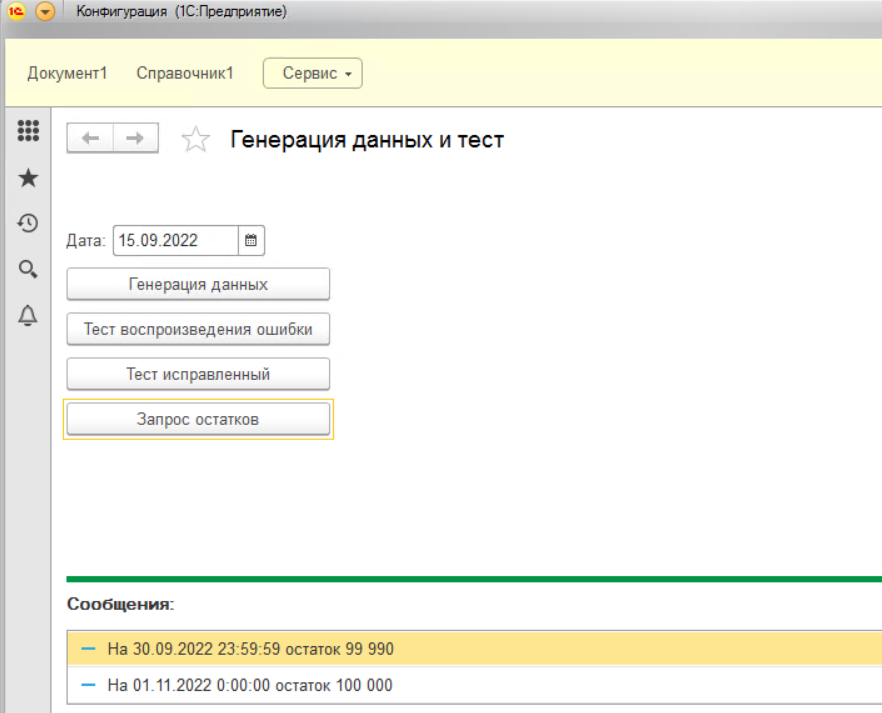

# Ссылка на ошибку для регистров накопления на сайте 1С
https://bugboard.v8.1c.ru/error/000060448

# Пример конфигурации для воспроизведения ошибки при перестановке границы итогов для регистров накопления.
Для воспроизведения ошибки при перестановке границы итогов для регистров накопления необходима платформа например 8.3.14.1993.
1. Загрузить конфигурацию из файлов из каталога src.
2. В обработке нажать один раз "Генерация данных".

3. После нажатия "Тест воспроизведения ошибки" и "Запрос остатков" будет выведено два отличающихся остатка.

На СУБД

_Period	_Fld33RRef	_Fld34	_Splitter

4022-10-01 00:00:00	0xA22F00155D039A5411ED34B1C1F89722	99990	0

5999-11-01 00:00:00	0xA22F00155D039A5411ED34B1C1F89722	100000	0

4. После нажатия "Тест исправленный" и "Запрос остатков" будет выведено два совпадающих остатка.

На СУБД

_Period	_Fld33RRef	_Fld34	_Splitter

4022-10-01 00:00:00	0xA22F00155D039A5411ED34B1C1F89722	100000	0

5999-11-01 00:00:00	0xA22F00155D039A5411ED34B1C1F89722	100000	0

# Приложена выгрузка XML для сценариев для воспроизведения ошибки на демо базе бухгалтерии с тестцентром.
Файл выгрузки "СценарииДляБухКорп.xml".
Для воспроизведения кроме платформы 1С потребуются лицензионные программные продукты.
1. Демо база "Бухгалтерия предприятия КОРП 3.0 (3.0.95.15)".
2. Встроить конфигурацию "Тест центр 2.0".
3. Загружать файл выгрузки при помощи обработки с ИТС "Выгрузка и загрузка данных XML.epf".